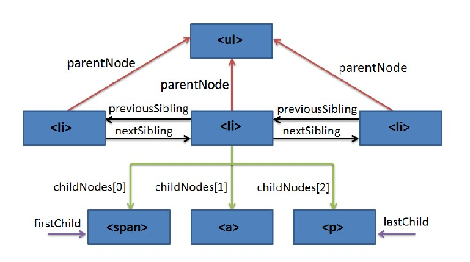

# 1. Introducció 

### Què és DOM? 

El DOM (Document Object Model) és una API per a XML, el que sense sigles vol dir que és una capa de programació intermèdia que representa un document i que ens permet modificar-lo. En altres paraules, és una sèrie de funcions i procediments que ens permeten treballar sobre un model abstracte d'un document, servint com a mitjà de comunicació entre el nostre llenguatge de programació (en aquest cas JavaScript) i els continguts del document.

**Quan una pàgina web és carregada, el navegador crea un Model d'Objectes del Document (DOM)** 

Cadascun dels elements (etiquetes) que es troben al fitxer `.html` es converteix en un node. Aquests nodes estan relacionats amb una relació pare-fill, de manera que un node pare pot tenir molts nodes fills, però un node fill només pot tenir un node pare. És per això que també se'l coneix com a arbre DOM. El node arrel del qual sorgeix tot l'arbre de nodes s'anomena `document`. 

**Exemple 1: Vegem en aquest exemple, si carreguem al navegador aquest fitxer html** 
```html
<!DOCTYPE html>
  <html>
    <head>
      <title>"My title"</title>
    </head>
    <body>
      <a href="#">My link</a>
      <h1>My header</h1>
    </body>
</html>

```

**automàticament es crearà aquest arbre de nodes.**


La creació automàtica per part del navegador de Document Object Model (DOM) és una de les innovacions que més ha influït en el desenvolupament de les pàgines web dinàmiques i de les aplicacions web més complexes. DOM permet als programadors web accedir i manipular els elements HTML, creant, modificant o eliminant-los. 

DOM s'ha convertit en una utilitat disponible per a la majoria de llenguatges de programació (Java, PHP, JavaScript) i les úniques diferències es troben en la forma d'implementar-ho.

---

# 2. Arbre de nodes 

Una de les tasques habituals en la programació d'aplicacions web amb JavaScript consisteix en la manipulació de les pàgines web. 

D'aquesta manera, és habitual obtenir el valor emmagatzemat per alguns elements (per exemple, els elements d'un formulari), crear elements (paràgrafs, `<div>`, etc.) de forma dinàmica i afegir-los a la pàgina, o aplicar animacions a un element (fer-lo aparèixer/desaparèixer, desplaçar-lo, etc.). 

Totes aquestes tasques són molt senzilles gràcies a DOM. Per això, els navegadors web transformen automàticament totes les pàgines web en una estructura més eficient de manipular. 

**Aquesta transformació la fan tots els navegadors de forma automàtica i ens permet utilitzar les eines de DOM de forma molt senzilla.** 

DOM transforma tots els documents HTML en un conjunt d'elements anomenats nodes, que estan interconnectats i representen els continguts de les pàgines web i les relacions entre aquests. Pel seu aspecte d'arbre amb una única arrel i múltiples branques, la unió de tots els nodes s'anomena "arbre de nodes". 

**El DOM no és part de JavaScript; de fet, pot ser utilitzat per altres llenguatges de programació. Tot i això, DOM està íntimament lligat a JavaScript, ja que aquest l'utilitzarà per accedir i modificar les pàgines web dinàmicament.**

**Exemple 2: Obtingueu l'arbre de nodes de la següent pàgina HTML senzilla.**

```html
<!DOCTYPE html>
<html>

  <head>
    <meta charset="UTF-8" />
    <title>Página sencilla</title>
  </head>

  <body>
    <p>Esta página es <strong>muy sencilla</strong></p>
  </body>
</html>
```

Es transforma en el següent arbre de nodes:


A l'esquema anterior, cada rectangle representa un node DOM i les fletxes indiquen les relacions entre nodes. Dins de cada node, s'inclou el tipus (que es veurà més endavant) i el contingut. Un document HTML que es carrega al navegador es converteix en un objecte `document`. Aquest objecte és el node arrel i propietari dels altres nodes. 

A partir d'aquest node arrel, cada etiqueta HTML es transforma en un node de tipus "Element". La conversió d'etiquetes en nodes es fa de forma jeràrquica. Per exemple:

- Del node arrel només poden derivar els nodes `HEAD` i `BODY`. 
- A partir d'aquesta derivació inicial, cada etiqueta HTML es transforma en un node que deriva del node corresponent a l'etiqueta pare.

### La transformació dels elements HTML habituals genera dos nodes:

1. Node de tipus "Element" (corresponent a la pròpia etiqueta HTML). 
2. Node de tipus "Text" que conté el text tancat per aquesta etiqueta HTML.

**Exemple 3: Obtingueu l'arbre de nodes de les etiquetes següents:**
`<title>`Pàgina sencilla`</title>`

**Genera els nodes següents:**

- Node de tipus "Element" corresponent a l'etiqueta `<p>`. 
- Node de tipus "Text" amb el contingut textual de l'etiqueta `<p>`. 

Si el contingut de `<p>` inclou a l'interior una altra etiqueta HTML, aquesta etiqueta interior es transforma en un node de tipus "Element" que representa l'etiqueta `<strong>` i que deriva del node anterior. El contingut de l'etiqueta `<strong>` genera un altre node de tipus "Text" que deriva del node generat per `<strong>`. 

---

## Transformació automàtica en arbre de nodes

La transformació automàtica de la pàgina en un arbre de nodes sempre segueix les mateixes regles: 

- Les etiquetes HTML es transformen en dos nodes:
  - El primer node és la pròpia etiqueta.
  - El segon node és el fill del primer i consisteix en el contingut textual de l'etiqueta.
- Si una etiqueta HTML es troba dins una altra, els nodes generats seran fills de la seva etiqueta pare.

Les pàgines HTML habituals produeixen arbres amb milers de nodes. Tot i així, el procés de transformació és ràpid i automàtic, i les funcions proporcionades per DOM permeten accedir a qualsevol node de la pàgina de forma senzilla i immediata.  

---

# 3. Nodes 

Els nodes són els elements sobre els quals es construeixen les connexions de l'arbre DOM. Poden tenir relació de pare, fill o germà: 

1. **Pare (parent):** Tots els nodes només tenen un pare, excepte l'arrel que no en té perquè és el node superior. 
2. **Fill (child):** Un node pot tenir un nombre indeterminat de fills (`ChildNodes()`).
3. **Germà (sibling):** Són nodes amb el mateix pare.

**En aquesta imatge es poden veure els nodes i les relacions.**

A l'esquema següent es pot veure l'estructura general de nodes d'un document.




---

## 3.1. Propietats dels nodes 

Independentment del tipus de node, hi ha una sèrie de propietats generals que comparteixen. La taula següent mostra algunes d'aquestes propietats:

| Propietat         | Descripció                                                          | Retorna                 |
|-------------------|---------------------------------------------------------------------|-------------------------|
| `nodeName`        | El nom del node, depenent del tipus de node.                        | Una cadena literal      |
| `nodeValue`       | El valor del node, depenent del tipus de node.                      | Una cadena literal      |
| `nodeType`        | Un número que representa el tipus de node.                          | Un número de l'1 al 12  |
| `ownerDocument`   | El document al qual pertany el node.                                | El document             |
| `firstChild`      | El primer fill del node.                                            | Un node                 |
| `lastChild`       | L'últim fill del node.                                              | Un node                 |
| `childNodes`      | Una llista dels fills del node.                                     | Una matriu de nodes     |
| `previousSibling` | El germà anterior al node o `null` si és el primer fill.            | Un node                 |
| `nextSibling`     | El germà següent al node o `null` si és l'últim fill.               | Un node                 |
| `hasChildNodes`   | Indica si el node té fills o no.                                    | Un booleà               |
| `atributs`        | Una llista amb els atributs del node.                               | Una matriu d'atributs   |

---

## Tipus de nodes 

L'especificació completa de DOM defineix 12 tipus de nodes, encara que les pàgines HTML habituals es poden manipular manejant només quatre o cinc tipus: 

- **Document:** Node arrel del qual deriven tots els altres nodes de l'arbre. 
- **Element:** Representa cadascuna de les etiquetes **HTML** És l'únic node que pot contenir atributs i del qual poden derivar altres nodes. 
- **Attr:** es defineix un node d'aquest tipus per representar cadascun dels atributs **de les etiquetes HTML**, és a dir, un per cada parell atribut=valor. 
- **Text:** Node que conté el **text tancat per una etiqueta HTML.** 
- **Comment:** Representa els **comentaris** inclosos a la pàgina HTML.

Els altres tipus de nodes existents són: `DocumentType`, `CDataSection`, `DocumentFragment`, `Entity`, `EntityReference`, `ProcessingInstruction` i `Notation`. 

Per a més informació, visita la [documentació de Mozilla](https://developer.mozilla.org/es/docs/Web/API/Node/nodeType).

---
## Elements anyadits

#### Exemple de Codi JavaScript

```javaScript
// Seleccionar un element per id
const title = document.getElementById('title');
console.log(title.innerText); // Mostra el text de l'element amb id "title"

// Afegir un nou element a la pàgina
const newParagraph = document.createElement('p');
newParagraph.textContent = 'Aquest és un paràgraf dinàmic.';
document.body.appendChild(newParagraph);

// Canviar el color d'un element existent
title.style.color = 'blue';

// Afegir un esdeveniment
newParagraph.addEventListener('click', () => {
  alert('Has fet clic al paràgraf!');
});
```

> Héctor Martínez Juan 1º DAM Semipresencial
